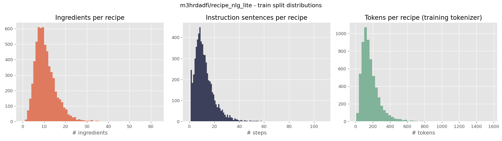
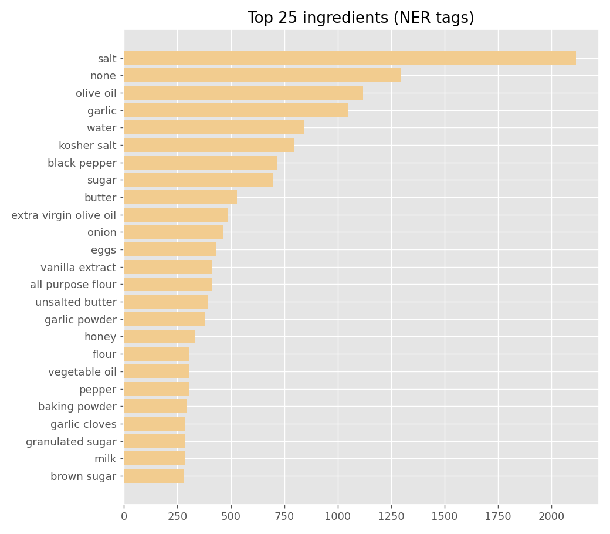

# Recipe "Generator" with Word2Vec + Semantic Similarity

A step-by-step guide to building, understanding, and deploying a recipe recommendation engine that trains a **Word2Vec** model on a cooking corpus, converts every recipe into a document vector, and uses **cosine similarity** to retrieve the closest recipes to a user's query — presented as a "generated" recipe card in a **Gradio** web app hosted on **Hugging Face Spaces**.

> **Honest framing:** this is *retrieval*, not true text generation. The "generation" is the rendering of the most semantically similar recipe from the corpus. Section 9 covers how to upgrade it to true generation (RAG / LLM).

---

## 1. What it does (user's view)

1. User types what they have or crave: *"chicken tomato basil pasta"*.
2. The app vectorizes the query with the trained Word2Vec model.
3. It compares that vector against all ~6K recipe vectors (a single matrix multiply).
4. The top-k most similar recipes are rendered as full recipe cards (ingredients + steps).

## 2. How it works (under the hood)

```
 raw recipes (name + NER + ingredients + steps)
        │  lowercase, strip punctuation, drop tokens ≤ 2 chars
        ▼
 one token list per recipe  ──────────────►  Word2Vec (Skip-gram, 128-dim)
        │                                          │
        │                                          ▼
        │                            mean of word vectors per recipe
        │                                          │
        ▼                                          ▼
   metadata.jsonl ◄──────────────  recipe_vectors.npy (L2-normalized)
                                                    ▲
 user query ──► same tokenization ──► mean vector ──┘
                                                    │
                                    dot product = cosine similarity
                                                    ▼
                                          top-k recipes → UI
```

| Stage | What happens | Why |
|---|---|---|
| **Corpus** | `recipe_nlg_lite` → 6,118 train recipes | Compact, clean, MIT-licensed |
| **Tokenize** | Each recipe = one document of name + NER tags + ingredients + steps | Co-occurrence of food words in the same document is the signal |
| **Word2Vec** | Skip-gram (`sg=1`), 128-dim, window 8, min_count 2, 15 epochs | Skip-gram works well on smaller corpora; rare-ish food words still get good vectors |
| **Doc vector** | Mean of all in-vocab word vectors, then L2-normalize | Simple, fast, surprisingly strong baseline (centroid of the recipe's semantics) |
| **Query vector** | Same averaging on the user's input | Puts query and docs in the same space |
| **Retrieval** | `recipe_vectors @ query_vec` → top-k | Both sides L2-normalized, so dot product **is** cosine similarity |

**Why L2-normalize?** After normalization, `cos(a,b) = a·b`, so the entire similarity search is one NumPy matrix-vector product over 6K×128 floats — sub-millisecond.

---

## 3. Repository structure

```
recipe-word2vec-hf/
├── README.md              ← you are here
├── requirements.txt
├── data_loader.py         ← downloads + parses the raw CSVs into clean dicts
├── analyze_dataset.py     ← EDA: stats + charts into analysis/
├── train.py               ← Word2Vec training + recipe vectors
├── app.py                 ← Gradio web app for HF Spaces
├── analysis/              ← generated: stats.json, charts, samples
└── data/                  ← generated: raw dataset archive + CSVs
```

---

## 4. Step 1 — Install dependencies

Python **3.10–3.12** recommended.

```bash
pip install -r requirements.txt
```

Key pins: `gensim>=4.3.3` with `numpy<2.0` and `scipy<1.14` (a known-good compatibility trio for gensim on Python 3.12).

> **Note on `datasets`:** the original design used `load_dataset("m3hrdadfi/recipe_nlg_lite")`, but that repo ships a legacy loading **script** which `datasets>=3.x` no longer executes. This repo instead downloads the underlying archive directly (via `gdown`) and parses it with `data_loader.py` — no `datasets` dependency, works on any modern install.

## 5. Step 2 — Fetch & analyze the dataset

```bash
python analyze_dataset.py
```

First run downloads the 6.7 MB archive (Google Drive) to `data/`, extracts `train.csv` / `test.csv`, and writes EDA artifacts to `analysis/`.

### Raw format gotchas handled by `data_loader.py`

The CSVs store `ner`, `ingredients`, `steps` as **comma-separated strings**, not lists. Worse, `steps` is a single text blob whose *sentences* are separated by `". "` while commas appear *inside* sentences. So:

- `ner`, `ingredients` → split on `", "`
- `steps` → split on `". "` into individual instruction sentences

(The original spec silently produced empty lists for these fields — this loader fixes that latent bug.)

### Analysis findings (measured, not guessed)

| Metric | Train | Test |
|---|---|---|
| Recipes | **6,118** | 1,080 (7,198 total ✓ matches dataset card) |
| Ingredients/recipe (mean / median / max) | 10.2 / 9 / 62 | 10.0 / 9 / 39 |
| Instruction sentences/recipe (mean / median / max) | 11.6 / 10 / 107 | 11.5 / 10 / 108 |
| Tokens/recipe after tokenizer (mean / p90 / max) | 172 / 300 / 1,564 | 170 / 296 / 1,407 |
| Total training tokens | **1,052,047** | 183,392 |
| Vocabulary (raw → `min_count=2`) | 13,980 → **9,059** | 6,840 → 4,544 |
| Token occurrences kept at `min_count=2` | **99.5%** | 98.7% |

Key takeaways:

- **All distributions are right-skewed** — most recipes are compact (≈9 ingredients, ≈10 steps) with a long tail of monsters. See `analysis/distributions.png`.
- **`min_count=2` is validated by the data**: it discards 35% of vocabulary *types* but only 0.5% of token *occurrences* — perfect for pruning noise without losing signal.
- **Top ingredients** (`analysis/top_ingredients.png`): `salt` (2,115), `olive oil` (1,119), `garlic` (1,050), `water`, `black pepper`, `sugar`, `butter`… The corpus is dominated by savory Western home cooking; expect the embedding neighborhood of *garlic* to include *onion*, *olive oil*, *clove*.
- **Quirk:** 1,298 train recipes carry the literal NER tag `"none"` — a data artifact worth knowing about (harmless for retrieval; filter it if you build diet/ingredient filters on NER).
- Most frequent tokens are cooking-verbs and units (`add`, `heat`, `cup`, `teaspoon`, `until`, `minutes`) — exactly the glue words that make doc-centroids cluster by *cuisine and technique*, which is what retrieval wants.





Artifacts produced: `analysis/stats.json`, `analysis/distributions.png`, `analysis/top_ingredients.png`, `analysis/sample_recipes.json`.

## 6. Step 3 — Train

```bash
python train.py
```

Pipeline (see `train.py`):

1. Load 6,118 recipes via `data_loader.load_split("train")`.
2. Tokenize each recipe into one document (name + NER + ingredients + steps).
3. Train Skip-gram Word2Vec: `vector_size=128, window=8, min_count=2, epochs=15, workers=4`. Runs in ~1–2 minutes on CPU.
4. Average word vectors per recipe → 6,118×128 matrix → L2-normalize rows.
5. Save to `hf_model_repo/`:
   - `word2vec.model` — gensim model
   - `recipe_vectors.npy` — the searchable matrix
   - `metadata.jsonl` — one JSON per line: `uid, name, link, ner, ingredients, steps`

Sanity check printed at the end: `most_similar("chicken")` should return food-adjacent words (`thigh`, `roast`, `breast`...). If it returns units like `cup`, training went wrong.

## 7. Step 4 — Push artifacts to the Hugging Face Hub

Create a write token at <https://huggingface.co/settings/tokens>, then either uncomment in `train.py`:

```python
push_to_hub(repo_id="your-username/recipe-word2vec")
```

or upload manually:

```bash
huggingface-cli login
huggingface-cli upload your-username/recipe-word2vec hf_model_repo/word2vec.model --repo-type model
huggingface-cli upload your-username/recipe-word2vec hf_model_repo/recipe_vectors.npy --repo-type model
huggingface-cli upload your-username/recipe-word2vec hf_model_repo/metadata.jsonl --repo-type model
```

## 8. Step 5 — Deploy the Gradio app on HF Spaces

1. Edit `app.py` line: `MODEL_REPO = "your-username/recipe-word2vec"`.
2. Test locally: `python app.py` → open `http://127.0.0.1:7860`.
3. Create a Space at <https://huggingface.co/new-space> (SDK: **Gradio**, blank).
4. Commit `app.py` + `requirements.txt` to the Space repo and push:

```bash
git add app.py requirements.txt
git commit -m "init recipe app"
git push
```

HF builds the container, pip-installs deps, downloads your three artifacts at startup, and serves the UI. Try the bundled examples (`chicken tomato cheese pasta`, `chocolate flour egg butter sugar`, ...).

---

## 9. Extending

- **True generation:** fine-tune GPT-2 / a small LLM on the corpus and feed the retrieved top-3 recipes as in-context examples (RAG).
- **Better embeddings:** swap Word2Vec for `sentence-transformers/all-MiniLM-L6-v2` (`util.cos_sim`) — less custom code, usually stronger retrieval.
- **Diet filters:** post-filter retrieved hits by NER tags (and remember to drop that `"none"` tag first).
- **Faster startup:** save gensim `KeyedVectors` only (`model.wv.save`) instead of the full model.

## 10. Troubleshooting

| Symptom | Fix |
|---|---|
| Google Drive download fails / quota hit | Re-run later, or place the extracted CSVs in `data/recipe_nlg_lite/` yourself |
| `gensim` import error on numpy 2.x | Keep `numpy<2.0` + `scipy<1.14` from `requirements.txt` |
| All similarities ≈ 0 | Query words missing from vocab (min_count=2); use common food words |
| Space build fails on gensim | Same numpy/scipy pins apply in the Space's `requirements.txt` |

---

*Dataset: [m3hrdadfi/recipe_nlg_lite](https://huggingface.co/datasets/m3hrdadfi/recipe_nlg_lite) (MIT) — 7,198 recipes derived from RecipeNLG.*
